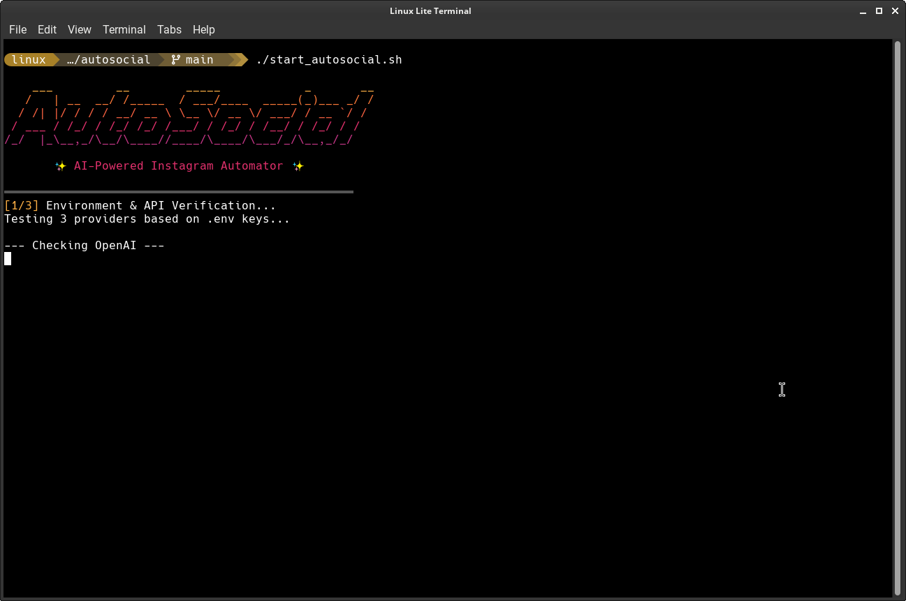

<div align="center">
  <h1>✨ AutoSocial AI ✨</h1>
  <p><strong>A fully autonomous, multi-LLM Instagram Orchestration Engine</strong></p>
  <br>
  
</div>

---

AutoSocial is a state-of-the-art, fully autonomous Instagram automation pipeline. It intelligently orchestrates cutting-edge Large Language Models (LLMs) to generate compelling editorial concepts, renders stunning typography-driven graphics natively in Python, and automatically publishes them directly to your Instagram feed—complete with trending background music.

Built with resilience in mind, AutoSocial never crashes due to API rate limits. Its dynamic fallback architecture guarantees 100% uptime by seamlessly hot-swapping providers on the fly.

## 🚀 Key Features

### 🧠 Multi-LLM Fallback Engine
AutoSocial does not rely on a single point of failure. It simultaneously interfaces with three distinct AI providers:
1. **OpenAI**
2. **Google Gemini**
3. **Groq**

If a provider hits a rate limit or goes down, the **FallbackProvider** instantly intercepts the error and seamlessly rolls over to the next available engine. This guarantees uninterrupted concept generation, caption writing, and hashtag extraction.
Furthermore, the LLM pipeline acts as an intelligent copywriter, explicitly extracting and writing a powerful **15-word maximum quote** from its own concept to be used in graphic generation, ensuring typography is always punchy.

### 🎨 Pure-Python "Paper Notes" Renderer
No heavy headless browsers (like Playwright or Selenium) are required. AutoSocial features a completely bespoke, pure-Python graphic design engine powered by **Pillow**:
- **Dynamic 4-Layout Architecture:** Intelligently scales and wraps text depending on character count and content structure, snapping into four unique layouts (`Symbol`, `Highlight`, `Statement`, or `Diagonal`).
- **Mathematical Inline Typography:** The engine calculates text bounding boxes word-by-word to mathematically draw yellow marker highlights behind words and double red underlines exactly where emphasis is needed.
- **Deterministic Aesthetics:** Uses a specialized hashing algorithm seeded by the text to procedurally pick paper texture colors (blush, taupe, sand, dust), SVG icons, and dynamic layouts so the exact same text will always render the exact same graphic.
- **Procedural Shadows & Grain:** Generates complex diagonal shadow overlays and alpha-composited noise grain entirely via mathematics to simulate real paper.

### 🌐 Pollinations.ai Image Fallback
In scenarios where custom background images are desired, AutoSocial seamlessly integrates with the unlimited, keyless **Pollinations.ai** API to generate 1080x1080 photorealistic background textures for free.

### 🎵 AI Vibe-Matched Instagrapi Publisher
The pipeline utilizes the reverse-engineered `instagrapi` library to bypass official Instagram API limitations. 
- It automatically logs into your account.
- The AI acts as a Music Supervisor, dynamically generating a specific `music_vibe` keyword (e.g., "ethereal synth" or "chill lofi") based specifically on the tone of the generated quote.
- It queries the Instagram Audio Library for that exact vibe, attaches the music, and publishes the photo directly to the grid.

### 🖥️ Beautiful CLI Dashboard & Safe Shutdowns
A highly polished bash wrapper (`start_autosocial.sh`) acts as the command center. 
- Features custom truecolor Instagram-gradient ASCII art.
- Provides real-time orchestration tracking via color-coded log boxes.
- Implements **Graceful Shutdowns:** Hitting `Ctrl+C` instantly traps the `KeyboardInterrupt`, halts all pipelines safely, and cleanly exits with a styled termination banner instead of a raw stack trace.

---

## 🛠️ Installation

### 1. Clone the Repository
```bash
git clone https://github.com/chriz-3656/autosocial.git
cd autosocial
```

### 2. Install Dependencies
Ensure you are using Python 3.10+ and install the required packages:
```bash
pip install -e .
```
*(Dependencies include `instagrapi`, `pillow`, `google-genai`, `openai`, `groq`, `pydantic`, etc.)*

### 3. Initialize the Design Engine
Run the included downloader script to fetch the required premium typography into the local cache for the Pillow engine:
```bash
python download_fonts.py
```

### 4. Environment Configuration
Duplicate the example environment file:
```bash
cp .env.example .env
```
Fill in your API keys and Instagram credentials. Due to the fallback engine, you only *need* one valid LLM key, but providing all three guarantees maximum resilience.
```env
# AI Providers
OPENAI_API_KEY=your_key_here
GEMINI_API_KEY=your_key_here
GROQ_API_KEY=your_key_here

# Instagram Account
INSTAGRAM_USERNAME=your_username
INSTAGRAM_PASSWORD=your_password
```

---

## ⚙️ Usage

To launch the autonomous pipeline, simply run the command center script:

```bash
./start_autosocial.sh
```

### What happens when you run this?
1. **`check_providers.py`** intercepts the launch, pings OpenAI, Gemini, and Groq, and verifies which systems are currently online and within quota limits.
2. **`run_real.py`** initializes the `BrainOrchestrator`.
3. The orchestration engine logs into Instagram and requests an editorial concept from the primary active LLM.
4. The AI copywriter pipeline generates a short quote, caption, hashtags, and a specific music vibe keyword.
5. The short quote and brand are passed to the **PillowPaperNotesRenderer**, which calculates the layout hash, selects the layout style (`Symbol`, `Highlight`, `Statement`, or `Diagonal`), draws mathematical highlights/shadows, and renders the 1080x1080 JPEG to `/tmp/`.
6. The `InstagrapiPublisher` takes the rendered JPEG, searches the Instagram audio library for the AI-generated music vibe, and pushes the final post live to your Instagram grid.

### 🎨 The AI Design Generator
If you want to generate a completely custom design from a free-text brief (e.g. "Create a dark streetwear quote post with grain and a thin border"), use the new AI Art Director mode:
```bash
python3 run_design.py --brief "Your creative brief here"
```
This triggers a strict, two-stage pipeline where the LLM constructs a precise JSON design specification, and a deterministic Python renderer handles the actual pixel generation for flawless, clipping-free output.

---

## 🏗️ Architecture Map

```text
autosocial/
├── start_autosocial.sh                # Main CLI dashboard
├── check_providers.py                 # Bootup API ping test
├── download_fonts.py                  # Typography fetcher for Pillow
├── run_real.py                        # The primary python orchestrator
├── run_design.py                      # AI Art Director & Design Generator CLI
│
└── src/autosocial/
    ├── core/
    │   └── config.py                  # Pydantic Settings & Env manager
    ├── providers/
    │   └── fallback_provider.py       # Multi-LLM switching logic
    ├── renderers/
    │   ├── pillow_editorial.py        # Advanced Python Graphic Engine
    │   └── pollinations_renderer.py   # Free AI image fallback generator
    └── publishers/
        └── instagrapi_publisher.py    # Auto-upload & Music logic
```
